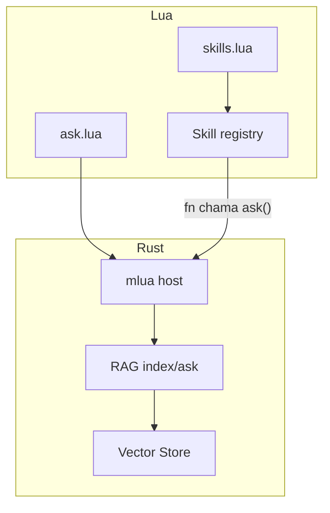

# Mnemo / rag-mnemo — Plan (como construir)

Companion de [spec.md](./spec.md).

## Abordagem SDD

1. Specify → `spec.md`  
2. Plan → este arquivo  
3. Tasks → checklist  
4. Implement → Rust + Lua  
5. Analyze → `cargo test` + smoke dos dois scripts  

## Arquitetura

```text
RAG:
  knowledge/*.md → chunk → embed(stub) → vector_store.json
  pergunta → embed → cosine top-k → hits

SKILL (camada em cima do RAG):
  register_skill(name, description, fn)
  run_skill(name, args) → fn usa ask() por dentro
  list_skills() → [{name, description}]

PROMPT → SKILL (sem LLM):
  dispatch("explica RAG") → escolhe explain_rag → run_skill
  dispatch("skill:explain_chunking") → run_skill pelo nome
```



**Analogia para iniciante**

| Peça | Analogia |
|------|----------|
| `ask("...")` | Abrir o caderno e procurar uma página |
| **Skill** | Uma ferramenta com **etiqueta** (“explicar RAG”) que já sabe *como* procurar |
| **Agent** (não neste projeto) | O estagiário que **decide sozinho** qual ferramenta usar |

## Módulos Rust

- `main.rs` — CLI: `rag-mnemo <script.lua> [pergunta|skill]` (`arg[1]` no Lua)
- `store.rs` — vector store + cosine + JSON
- `rag.rs` — chunk, embed stub, index, query
- `lua_api.rs` — `index`, `ask`, `log`, `register_skill`, `run_skill`, `list_skills`, `dispatch`

## Tasks

### Núcleo RAG (CAP-1…3)
- [x] `Cargo.toml` + bin `rag-mnemo`
- [x] `store.rs` + testes cosine
- [x] `rag.rs` chunk + embed stub + index/query
- [x] `lua_api.rs` — `index`, `ask`, `log`
- [x] `scripts/ask.lua`
- [x] `.gitignore`

### Skills (CAP-5)
- [x] Registry de skills no host Lua (HashMap name → descrição + callback)
- [x] `register_skill(name, description, fn)`
- [x] `run_skill(name, args_table)` / `list_skills()`
- [x] `scripts/skills.lua` — registra `explain_rag` e `explain_chunking`; CLI passa o nome
- [x] `dispatch(texto)` — `skill:nome` ou palavras-chave (rag, chunking, embedding, skill)
- [x] `docs/WHAT_IS_A_SKILL.md` (inclui “Skills e o prompt”)
- [x] `knowledge/skill.md` (indexável pelo RAG)

### Analyze
- [x] `cargo test`
- [x] Smoke: `cargo run -- scripts/ask.lua`
- [x] Smoke: `cargo run -- scripts/skills.lua`

## Docs

- README (RAG + Skill)
- `docs/WHAT_IS_A_SKILL.md`
- `.specify/CONTEXT.md` (estado atual; atualizar junto com o código)
- `.specify/COMMITS.md` (conventional commits + emoji)
- `AGENTS.md` (briefing do agente Cursor)
- `knowledge/*.md` (textos indexáveis)
