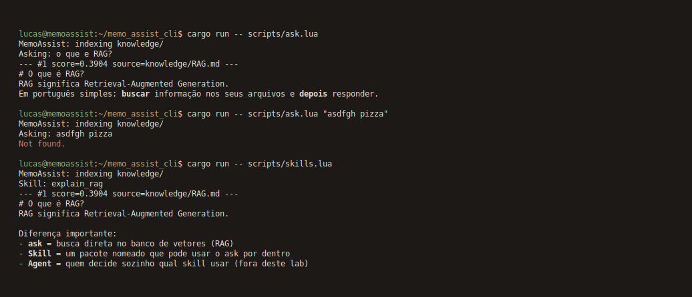

# MemoAssist

> **Memória para os seus documentos.**  
> Lab mínimo de **RAG + Skills** com **Rust + Lua**.  
> 100% offline. Spec-Driven (SDD).



| | |
|--|--|
| Stack | Rust (core) + Lua (scripts) |
| Persistência | `vector_store.json` |
| Embeddings | stub determinístico (hash), sem API |
| Fora de escopo | Agent loop, OpenAI, UI web, Qdrant |

## SDD (comece por aqui)

| Arquivo | Papel |
|---------|--------|
| [`.specify/SPEC.md`](.specify/SPEC.md) | **O quê** (fonte da verdade) |
| [`.specify/PLAN.md`](.specify/PLAN.md) | **Como** + tasks |
| [`.specify/CONTEXT.md`](.specify/CONTEXT.md) | Estado atual (retoma o lab sem o chat) |
| [`.specify/COMMITS.md`](.specify/COMMITS.md) | Conventional commits + emoji |
| [`AGENTS.md`](AGENTS.md) | Briefing fixo para o agente Cursor |
| [`docs/WHAT_IS_A_SKILL.md`](docs/WHAT_IS_A_SKILL.md) | Skill Lua explicada para iniciante |
| [`.cursor/skills/README.md`](.cursor/skills/README.md) | Agent Skills do Cursor (este repo) |
| [`docs/images/cli.png`](docs/images/cli.png) | Print da CLI |
| Este README | Visão geral |

Se código e spec divergirem, a **spec manda**.

## Dois conceitos que você aprende aqui

### 1) RAG
Indexar → buscar trechos parecidos → usar como contexto (aqui: imprimir hits).

### 2) Skill
Capacidade **nomeada** (`explain_rag`) que por dentro chama `ask(...)`.

Como “usar no prompt” neste lab (sem LLM):

1. `run_skill("explain_rag", {})` — você escolhe o nome
2. `dispatch("skill:explain_rag")` — o texto traz o nome
3. `dispatch("explica o que e RAG")` — palavras-chave escolhem a skill

Detalhe: [`docs/WHAT_IS_A_SKILL.md`](docs/WHAT_IS_A_SKILL.md) → seção **Skills e o prompt**.

| | RAG (`ask`) | Skill | Agent (conceito, fora deste lab) |
|--|-------------|-------|----------------------------------|
| Ideia | Busca no caderno | Ferramenta com etiqueta | Programa que escolhe qual ferramenta usar |
| Neste repo | Sim | Sim | Não |

## Como rodar

```bash
git clone git@github.com:silvalnk/ai-memo-assist-cli.git
cd ai-memo-assist-cli
cargo test
cargo run -- scripts/ask.lua                    # pergunta padrão: o que e RAG?
cargo run -- scripts/ask.lua "o que e chunking?"
cargo run -- scripts/ask.lua "asdfgh pizza"
cargo run -- scripts/skills.lua                      # skill padrão: explain_rag
cargo run -- scripts/skills.lua explain_chunking
```

Sem trecho relacionado, o script imprime `Not found.` Sem argumento, `ask.lua` usa a pergunta da spec e `skills.lua` usa `explain_rag`.

## Estrutura

```
ai-memo-assist-cli/
  AGENTS.md                  # briefing do agente (nova sessão)
  .specify/SPEC.md
  .specify/PLAN.md
  .specify/CONTEXT.md        # estado atual do lab
  docs/WHAT_IS_A_SKILL.md
  docs/images/cli.png
  knowledge/
  scripts/ask.lua
  scripts/skills.lua
  src/                       # Rust: store, rag, lua_api, dispatch
```

## Knowledge base

Textos curtos em `knowledge/` (RAG, chunking, embeddings, skill) — feitos para indexar e perguntar.
